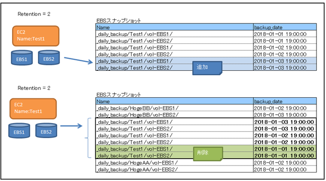

## EC2_Backup

### 動作

  1. スナップショット作成
    - スクリプトを実行するEC2にアタッチしている全EBSを対象にEBSスナップショット作成する。
    - EBSスナップショットには `Name` と `backup_date` タグを付与する。
      -  `Name` タグのフォーマット
        - `[config.jsonのBackup_prefix]/[EC2のNameタグ]/[EBSのVolumeID]/`
  2. 過去スナップショット削除
    - スクリプトを実行するEC2にアタッチしている全EBSのスナップショットで、そのEC2から生成されるEBSスナップショットの`Name`タグに <br />
      該当するEBSスナップショットを抽出。
    - さらに抽出したEBSスナップショットのタグ`backup_date`で降順ソートし、[config.json](config.json)の`Retention`の値より後ろを削除する。

    

### Requirements

  - **xfsファイルシステム** のみ対象。
  - xfs_freezeコマンド
    - 内部で`xfs_freeze`を実行しています。 
    - `xfs_freeze`コマンドは **本番環境などで安易に実行しないこと** ！。
  - python3.6.4
    - [setup.sh](setup.sh)で仮想環境を作成することを推奨。下記セットアップ手順参照。

### セットアップ

  - インストール

  ```
  git clone https://github.com/tamutamu/aws_ec2_backup.git
  cd aws_ec2_backup

  ## pythonの仮想環境を作成します。(by pyenv, pyenv-virtualenv)
  ## [実行ユーザのホームディレクトリ]/.pyenv に構築します。
  ## aws_ec2_backupディレクトリに'ec2_backup'ローカル設定をします。
  ./setup.sh

  ## 確認
  pyenv versions
  cat .python-version

  ## ec2_backupモジュールと依存ライブラリをインストールします。
  python setup.py install

  ## 確認
  pip list
  ```
  
  - IAMロール設定例
  ```
  {
    "Version": "2012-10-17",
    "Statement": [
        {
            "Sid": "VisualEditor0",
            "Effect": "Allow",
            "Action": [
                "ec2:Describe*",
                "ec2:CreateTags",
                "ec2:CreateSnapshot",
                "ec2:DeleteSnapshot"
            ],
            "Resource": "*"
        }
      ]
  }
  
  ```

### 設定

  - [config.json](config.json)

|キー|説明|
|:---|:---|
|Region|バックアップするEC2のリージョン|
|Retention|バックアップを保持する数|
|Backup_prefix|EBSスナップショットのNameタグに設定するプレフィックス|
|Backup_mount_points|EBSスナップショット取得時にxfs_freezeするマウントポイント|

### 実行方法

  - [exec_ec2_backup.sh](exec_ec2_backup.sh)
```
./ec_ec2_backup.sh
```

  - 注意事項
    - スクリプトを修正した場合は`python setup.py install`し直してください。

### Cronの設定

  - `crontab -e`
  ```
  30 21 * * * bash -l /_path/aws_ec2_backup/exec_ec2_backup.sh
  ```
